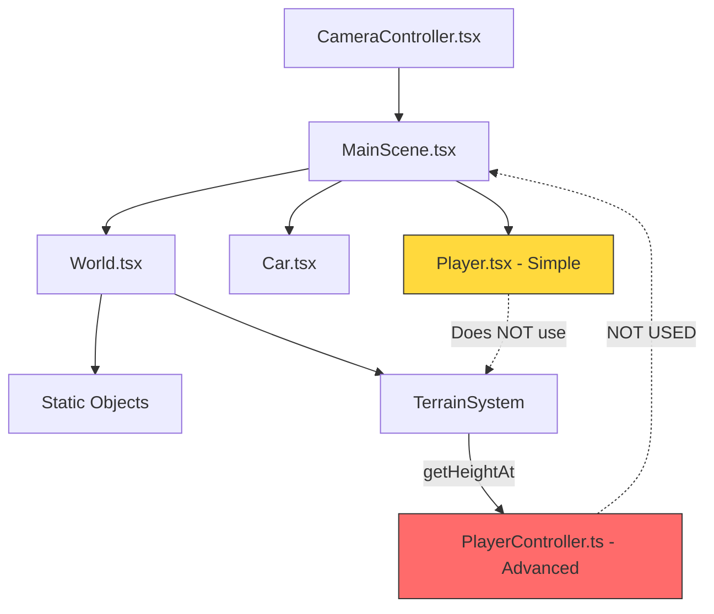
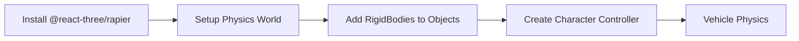

# Three.js Physics Analysis & Improvement Plan

## Executive Summary

This document analyzes the current physics implementation in the 3D portfolio project and provides a comprehensive improvement plan. The analysis reveals several critical issues with player movement, car physics, and collision detection.

---

## Current Architecture Overview



---

## Issues Found

### 1. Player Physics Issues - [`Player.tsx`](src/components/3d/Player.tsx)

| Issue | Severity | Description |
|-------|----------|-------------|
| No Terrain Following | **HIGH** | Player uses hardcoded ground level `y = 1.7` instead of terrain height |
| No Collision Detection | **HIGH** | Player can walk through all buildings, trees, and objects |
| No Slope Handling | **MEDIUM** | Player does not adjust movement based on terrain slope |
| Simple Gravity | **LOW** | Basic gravity without proper physics simulation |
| No Character Controller | **MEDIUM** | Missing capsule-based collision for character body |

**Code Evidence:**
```typescript
// Line 90-96 in Player.tsx - Hardcoded ground level
if (camera.position.y <= 1.7) {
    camera.position.y = 1.7;
    velocity.current.y = 0;
    isGrounded.current = true;
}
```

### 2. Car Physics Issues - [`Car.tsx`](src/components/3d/Car.tsx)

| Issue | Severity | Description |
|-------|----------|-------------|
| No Terrain Following | **HIGH** | Car stays at fixed `y = 0.5` regardless of terrain |
| No Collision Detection | **HIGH** | Car can drive through all objects |
| No Suspension | **MEDIUM** | No suspension physics for realistic movement |
| No Wheel Physics | **MEDIUM** | Wheels do not follow terrain surface |
| Brake Not Implemented | **LOW** | Brake key mapped but not used in physics |
| No Friction Model | **MEDIUM** | No tire friction simulation |

**Code Evidence:**
```typescript
// Line 22 in Car.tsx - Fixed Y position
const carPosition = useRef(new THREE.Vector3(0, 0.5, 0));

// Line 98-99 - No Y-axis terrain adjustment
carPosition.current.x += xDir * velocity.current * delta;
carPosition.current.z += zDir * velocity.current * delta;
```

### 3. Dual Player System Issue

There are **TWO** player implementations:

| File | Status | Features |
|------|--------|----------|
| [`Player.tsx`](src/components/3d/Player.tsx) | **ACTIVE** | Simple, no terrain collision |
| [`PlayerController.ts`](src/player/PlayerController.ts) | **INACTIVE** | Advanced with terrain following |

The advanced `PlayerController.ts` has:
- Terrain height following via `TerrainSystem.getHeightAt()`
- Multi-point ground sampling for collision
- Slope detection with `MAX_STEP_HEIGHT`
- State machine integration

**But it is NOT being used in the application!**

### 4. World Collision Issues - [`World.tsx`](src/components/3d/World.tsx)

| Issue | Severity | Description |
|-------|----------|-------------|
| No Collision Data | **HIGH** | Objects have no collision meshes or bounding boxes |
| Visual Only | **HIGH** | All buildings, trees, decorations are purely visual |
| No Physics Bodies | **HIGH** | No physics representation for any world objects |

### 5. Terrain System - [`TerrainSystem.ts`](src/core/systems/TerrainSystem.ts)

The terrain system is well-implemented but **not integrated**:
- `getHeightAt(x, z)` - Returns terrain height at position
- `getNormalAt(x, z)` - Returns surface normal for slope
- `getRegionAt(x, z)` - Returns terrain type

---

## Improvement Plan

### Phase 1: Integrate Physics Library

**Recommendation:** Use `@react-three/rapier` - A modern physics engine for React Three Fiber



**Tasks:**
1. Install `@react-three/rapier` package
2. Wrap scene with `<Physics>` component
3. Add `<RigidBody>` to all collidable objects
4. Create character controller with capsule collider
5. Implement vehicle physics with wheel colliders

### Phase 2: Player Physics Improvements

#### Option A: Fix Current Player.tsx (Quick Fix)

```typescript
// Add terrain following to Player.tsx
import { TerrainSystem } from '@/core/systems/TerrainSystem';

// In useFrame:
const groundHeight = TerrainSystem.getHeightAt(
    camera.position.x, 
    camera.position.z
);

if (camera.position.y <= groundHeight + PLAYER_HEIGHT) {
    camera.position.y = groundHeight + PLAYER_HEIGHT;
    // ...
}
```

#### Option B: Use PlayerController.ts (Better)

Integrate the existing advanced `PlayerController.ts`:

```typescript
// In MainScene.tsx
import { PlayerController } from '@/player/PlayerController';

// Initialize and use the controller
const playerController = useRef<PlayerController | null>(null);

useEffect(() => {
    playerController.current = new PlayerController(
        new Vector3(0, 2, 20),
        { walkSpeed: 5, runSpeed: 10 }
    );
    playerController.current.initialize();
}, []);
```

#### Option C: Full Rapier Integration (Best)

```typescript
// Player with Rapier character controller
import { RigidBody, CapsuleCollider } from '@react-three/rapier';

function Player() {
    return (
        <RigidBody 
            type="dynamic"
            colliders={false}
            enabledRotations={[false, false, false]}
        >
            <CapsuleCollider args={[0.5, 0.5]} />
            {/* Player mesh */}
        </RigidBody>
    );
}
```

### Phase 3: Car Physics Improvements

#### Current Implementation Issues:
```typescript
// Car.tsx - Missing terrain following
carPosition.current.x += xDir * velocity.current * delta;
carPosition.current.z += zDir * velocity.current * delta;
// Missing: carPosition.current.y = terrainHeight + suspensionOffset;
```

#### Improved Implementation:

```typescript
// Add terrain following
const terrainY = TerrainSystem.getHeightAt(
    carPosition.current.x,
    carPosition.current.z
);
carPosition.current.y = terrainY + SUSPENSION_HEIGHT;

// Add collision detection
const raycaster = new THREE.Raycaster();
const direction = new THREE.Vector3(0, -1, 0);
raycaster.set(carPosition.current, direction);
const intersects = raycaster.intersectObjects(collidableObjects);
```

#### With Rapier (Recommended):

```typescript
import { RigidBody, CuboidCollider } from '@react-three/rapier';

function Car() {
    return (
        <RigidBody type="dynamic">
            <CuboidCollider args={[1, 0.5, 2]} />
            {/* Car body mesh */}
            {/* Wheel colliders with suspension */}
        </RigidBody>
    );
}
```

### Phase 4: World Collision Setup

Add collision to world objects:

```typescript
// In World.tsx - Add collision to buildings
function Building({ position }: { position: [number, number, number] }) {
    return (
        <RigidBody type="fixed">
            <mesh position={position} castShadow receiveShadow>
                <boxGeometry args={[4, 8, 4]} />
                <meshStandardMaterial />
            </mesh>
        </RigidBody>
    );
}

// Add collision to trees
function PalmTree({ position }: { position: [number, number, number] }) {
    return (
        <group position={position}>
            {/* Visual trunk */}
            <mesh><cylinderGeometry args={[0.3, 0.4, 8]} /></mesh>
            {/* Collision trunk */}
            <RigidBody type="fixed">
                <CylinderCollider args={[4, 0.4]} />
            </RigidBody>
            {/* Leaves - no collision needed */}
        </group>
    );
}
```

### Phase 5: Collision Detection System

Create a collision manager:

```typescript
// src/core/CollisionManager.ts
export class CollisionManager {
    private collidables: THREE.Object3D[] = [];
    
    registerCollidable(object: THREE.Object3D) {
        this.collidables.push(object);
    }
    
    checkCollision(
        position: THREE.Vector3,
        radius: number
    ): THREE.Vector3 | null {
        // Sphere collision check
        for (const obj of this.collidables) {
            const box = new THREE.Box3().setFromObject(obj);
            if (box.intersectsSphere(
                new THREE.Sphere(position, radius)
            )) {
                return box.getCenter(new THREE.Vector3());
            }
        }
        return null;
    }
}
```

---

## Recommended Implementation Order

```mermaid
gantt
    title Physics Implementation Timeline
    dateFormat  X
    axisFormat %s
    
    section Phase 1
    Install Rapier           :p1a, 0, 1
    Setup Physics World      :p1b, after p1a, 1
    
    section Phase 2
    Player Terrain Following :p2a, after p1b, 2
    Player Collision         :p2b, after p2a, 2
    
    section Phase 3
    Car Terrain Following    :p3a, after p2b, 2
    Car Collision            :p3b, after p3a, 2
    
    section Phase 4
    World Object Collision   :p4, after p3b, 3
    
    section Phase 5
    Testing & Polish         :p5, after p4, 2
```



---

## Quick Wins (Can Implement Immediately)

### 1. Player Terrain Following (5 minutes)

Add to [`Player.tsx`](src/components/3d/Player.tsx):

```typescript
import { TerrainSystem } from '@/core/systems/TerrainSystem';

// Replace hardcoded ground check
const groundHeight = TerrainSystem.getHeightAt(
    camera.position.x,
    camera.position.z
) + PLAYER_HEIGHT;

if (camera.position.y <= groundHeight) {
    camera.position.y = groundHeight;
    velocity.current.y = 0;
    isGrounded.current = true;
}
```

### 2. Car Terrain Following (5 minutes)

Add to [`Car.tsx`](src/components/3d/Car.tsx):

```typescript
import { TerrainSystem } from '@/core/systems/TerrainSystem';

// After position update
const terrainY = TerrainSystem.getHeightAt(
    carPosition.current.x,
    carPosition.current.z
);
carPosition.current.y = terrainY + 0.5;
```

### 3. Simple Collision Detection (15 minutes)

Add bounding box collision:

```typescript
// Create collision boxes for major objects
const collisionBoxes: THREE.Box3[] = [];

// In World.tsx, create boxes for buildings
buildings.forEach(building => {
    const box = new THREE.Box3().setFromObject(building);
    collisionBoxes.push(box);
});

// In Player.tsx, check collision
const playerBox = new THREE.Box3().setFromCenterAndSize(
    camera.position,
    new THREE.Vector3(1, 2, 1) // Player size
);

for (const box of collisionBoxes) {
    if (playerBox.intersectsBox(box)) {
        // Push player back
    }
}
```

---

## Files to Modify

| File | Changes Required |
|------|-----------------|
| [`Player.tsx`](src/components/3d/Player.tsx) | Add terrain following, collision detection |
| [`Car.tsx`](src/components/3d/Car.tsx) | Add terrain following, collision, suspension |
| [`World.tsx`](src/components/3d/World.tsx) | Add collision data to objects |
| [`MainScene.tsx`](src/components/3d/MainScene.tsx) | Integrate physics world if using Rapier |
| [`TerrainSystem.ts`](src/core/systems/TerrainSystem.ts) | Already good, just needs integration |

---

## Questions for Clarification

Before proceeding with implementation, please clarify:

1. **Physics Approach**: Do you prefer:
   - Quick fixes using existing code
   - Full Rapier physics engine integration
   - Custom collision system

2. **Player Controller**: Should we:
   - Fix the current `Player.tsx`
   - Switch to `PlayerController.ts`
   - Create new with Rapier

3. **Performance Priority**: Is performance a concern?
   - Many collision objects can impact performance
   - Rapier is optimized but adds bundle size

4. **Scope**: Which improvements are priority?
   - Player movement only
   - Car physics only
   - Full world collision
