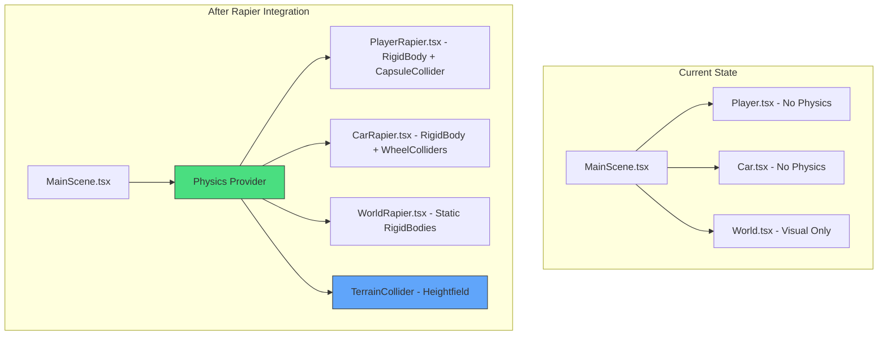

# Full Rapier Physics Integration Plan

## Overview

This document provides a comprehensive implementation plan for integrating `@react-three/rapier` physics engine into the 3D portfolio project. This will enable realistic physics simulation including collision detection, terrain following, and proper character/vehicle physics.

---

## Architecture Overview



---

## Prerequisites

### Package Installation

```bash
npm install @react-three/rapier
```

### Bundle Size Impact
- Rapier WASM: ~500KB (gzipped ~200KB)
- React Three Rapier: ~50KB

---

## Implementation Phases

### Phase 1: Setup Physics World

#### 1.1 Create Physics Provider

**File:** `src/physics/PhysicsProvider.tsx`

```typescript
'use client';

import { Physics, Debug } from '@react-three/rapier';
import { Suspense } from 'react';

interface PhysicsProviderProps {
    children: React.ReactNode;
    debug?: boolean;
}

export function PhysicsProvider({ children, debug = false }: PhysicsProviderProps) {
    return (
        <Physics
            gravity={[0, -20, 0]} // Match current GRAVITY constant
            timeStep="vary"
            paused={false}
        >
            {debug && <Debug />}
            {children}
        </Physics>
    );
}
```

#### 1.2 Update MainScene.tsx

**File:** `src/components/3d/MainScene.tsx`

```typescript
// Add import
import { PhysicsProvider } from '@/physics/PhysicsProvider';

// Wrap the scene content
<Canvas ...>
    <Suspense fallback={null}>
        <PhysicsProvider debug={process.env.NODE_ENV === 'development'}>
            {/* All 3D content */}
        </PhysicsProvider>
    </Suspense>
</Canvas>
```

---

### Phase 2: Terrain Collision

#### 2.1 Create Heightfield Collider

**File:** `src/physics/TerrainCollider.tsx`

```typescript
'use client';

import { useHeightfield } from '@react-three/rapier';
import { useMemo } from 'react';
import { TerrainSystem, TERRAIN_CONFIG } from '@/core/systems/TerrainSystem';

export function TerrainCollider() {
    const { size, resolution } = TERRAIN_CONFIG;
    
    // Generate heightfield data
    const heightfieldData = useMemo(() => {
        const data: number[][] = [];
        const step = size / resolution;
        
        for (let i = 0; i < resolution; i++) {
            const row: number[] = [];
            for (let j = 0; j < resolution; j++) {
                const x = -size / 2 + j * step;
                const z = -size / 2 + i * step;
                const height = TerrainSystem.getHeightAt(x, z);
                row.push(height);
            }
            data.push(row);
        }
        return data;
    }, []);
    
    // Create heightfield collider
    const heightfieldOptions = useMemo(() => ({
        args: [size, size, heightfieldData],
        position: [0, 0, 0] as [number, number, number],
        rotation: [0, 0, 0] as [number, number, number],
        scale: [1, 1, 1] as [number, number, number],
    }), [heightfieldData, size]);
    
    useHeightfield(heightfieldOptions);
    
    return null;
}
```

#### 2.2 Alternative: Use Instanced Mesh Colliders

For better performance with complex terrain:

**File:** `src/physics/GroundColliders.tsx`

```typescript
'use client';

import { RigidBody, CuboidCollider } from '@react-three/rapier';
import { useMemo } from 'react';

// Create colliders for main ground platforms
export function GroundColliders() {
    // Main island collider
    return (
        <>
            {/* Central Plaza Island */}
            <RigidBody type="fixed" position={[0, -2, 0]}>
                <CuboidCollider args={[120, 2, 120]} />
            </RigidBody>
            
            {/* Projects Platform */}
            <RigidBody type="fixed" position={[0, 0, -20]}>
                <CuboidCollider args={[12.5, 0.1, 7.5]} />
            </RigidBody>
            
            {/* Blog Platform */}
            <RigidBody type="fixed" position={[0, 0, 10]}>
                <CuboidCollider args={[10, 0.05, 10]} />
            </RigidBody>
            
            {/* Road */}
            <RigidBody type="fixed" position={[0, 0.05, 0]}>
                <CuboidCollider args={[6, 0.1, 70]} />
            </RigidBody>
        </>
    );
}
```

---

### Phase 3: Player Physics

#### 3.1 Create Player with Rapier

**File:** `src/components/3d/PlayerRapier.tsx`

```typescript
'use client';

import { useRef, useEffect } from 'react';
import { useFrame, useThree } from '@react-three/fiber';
import { RigidBody, CapsuleCollider, useRapier } from '@react-three/rapier';
import { useKeyboardControls } from '@react-three/drei';
import * as THREE from 'three';
import type { RigidBody as RapierRigidBody } from '@dimforge/rapier3d-compat';

interface PlayerRapierProps {
    locked: boolean;
    isDriving: boolean;
}

const SPEED = 5;
const SPRINT_MULTIPLIER = 1.8;
const JUMP_FORCE = 8;
const PLAYER_HEIGHT = 1.7;

export default function PlayerRapier({ locked, isDriving }: PlayerRapierProps) {
    const { camera } = useThree();
    const [sub, get] = useKeyboardControls();
    const rigidBodyRef = useRef<RapierRigidBody>(null);
    const { rapier, world } = useRapier();
    
    // Movement state
    const velocity = useRef(new THREE.Vector3());
    const direction = useRef(new THREE.Vector3());
    const canJump = useRef(true);
    
    // Store last position for car transitions
    const lastPosition = useRef(new THREE.Vector3(0, PLAYER_HEIGHT, 5));
    
    // Handle car transition
    useEffect(() => {
        if (!rigidBodyRef.current) return;
        
        if (!isDriving) {
            // Reset velocity when exiting car
            rigidBodyRef.current.setLinvel({ x: 0, y: 0, z: 0 }, true);
            rigidBodyRef.current.setTranslation(
                { x: lastPosition.current.x, y: PLAYER_HEIGHT, z: lastPosition.current.z },
                true
            );
        }
    }, [isDriving]);
    
    useFrame((state, delta) => {
        if (!rigidBodyRef.current || isDriving || !locked) return;
        
        const { forward, backward, left, right, sprint, jump } = get();
        const speed = (sprint ? SPRINT_MULTIPLIER : 1) * SPEED;
        
        // Get current position and velocity
        const position = rigidBodyRef.current.translation();
        const currentVel = rigidBodyRef.current.linvel();
        
        // --- Horizontal Movement ---
        direction.current.set(0, 0, 0);
        if (forward) direction.current.z -= 1;
        if (backward) direction.current.z += 1;
        if (left) direction.current.x -= 1;
        if (right) direction.current.x += 1;
        
        if (direction.current.length() > 0) {
            direction.current.normalize();
            
            // Get camera direction for movement
            const cameraDirection = new THREE.Vector3();
            camera.getWorldDirection(cameraDirection);
            cameraDirection.y = 0;
            cameraDirection.normalize();
            
            const cameraRight = new THREE.Vector3();
            cameraRight.crossVectors(cameraDirection, new THREE.Vector3(0, 1, 0));
            
            // Calculate movement vector
            const moveVector = new THREE.Vector3();
            moveVector.addScaledVector(cameraDirection, -direction.current.z * speed);
            moveVector.addScaledVector(cameraRight, direction.current.x * speed);
            
            // Apply velocity
            rigidBodyRef.current.setLinvel(
                { x: moveVector.x, y: currentVel.y, z: moveVector.z },
                true
            );
        } else {
            // Stop horizontal movement
            rigidBodyRef.current.setLinvel(
                { x: 0, y: currentVel.y, z: 0 },
                true
            );
        }
        
        // --- Jump ---
        if (jump && canJump.current) {
            // Check if grounded using raycast
            const ray = world.castRay(
                new rapier.Ray(
                    { x: position.x, y: position.y, z: position.z },
                    { x: 0, y: -1, z: 0 }
                ),
                PLAYER_HEIGHT + 0.1,
                true
            );
            
            if (ray && ray.toi < PLAYER_HEIGHT + 0.2) {
                rigidBodyRef.current.applyImpulse(
                    { x: 0, y: JUMP_FORCE, z: 0 },
                    true
                );
                canJump.current = false;
                setTimeout(() => { canJump.current = true; }, 100);
            }
        }
        
        // --- Camera Follow ---
        const playerPos = new THREE.Vector3(position.x, position.y, position.z);
        camera.position.x = playerPos.x;
        camera.position.z = playerPos.z;
        camera.position.y = position.y + PLAYER_HEIGHT * 0.5;
        
        // Clamp to world bounds
        const clampedPos = {
            x: Math.max(-150, Math.min(150, position.x)),
            y: position.y,
            z: Math.max(-150, Math.min(150, position.z))
        };
        
        if (position.x !== clampedPos.x || position.z !== clampedPos.z) {
            rigidBodyRef.current.setTranslation(clampedPos, true);
        }
        
        // Save position
        lastPosition.current.copy(playerPos);
    });
    
    return (
        <RigidBody
            ref={rigidBodyRef}
            type="dynamic"
            position={[0, PLAYER_HEIGHT, 5]}
            enabledRotations={[false, false, false]}
            linearDamping={0.5}
            angularDamping={1}
            friction={0.5}
            restitution={0}
            colliders={false}
        >
            <CapsuleCollider args={[PLAYER_HEIGHT * 0.4, 0.4]} />
        </RigidBody>
    );
}
```

---

### Phase 4: Car Physics

#### 4.1 Create Vehicle with Rapier

**File:** `src/components/3d/CarRapier.tsx`

```typescript
'use client';

import { useRef, useEffect, useState } from 'react';
import { useFrame, useThree } from '@react-three/fiber';
import { RigidBody, CuboidCollider, useRapier } from '@react-three/rapier';
import { useKeyboardControls } from '@react-three/drei';
import * as THREE from 'three';
import type { RigidBody as RapierRigidBody } from '@dimforge/rapier3d-compat';

interface CarRapierProps {
    isDriving: boolean;
    onExitCar: () => void;
}

const MAX_SPEED = 20;
const ACCELERATION = 15;
const TURN_SPEED = 2.5;
const CAR_MASS = 1000;

export default function CarRapier({ isDriving, onExitCar }: CarRapierProps) {
    const carRef = useRef<THREE.Group>(null);
    const rigidBodyRef = useRef<RapierRigidBody>(null);
    const { camera } = useThree();
    const [sub, get] = useKeyboardControls();
    const { rapier, world } = useRapier();
    
    // Car state
    const steering = useRef(0);
    const currentSpeed = useRef(0);
    const currentLookAt = useRef(new THREE.Vector3());
    
    // Exit car with E key
    useEffect(() => {
        const handleKeyDown = (e: KeyboardEvent) => {
            if (!isDriving) return;
            if (e.key.toLowerCase() === 'e') {
                onExitCar();
            }
            if (e.key.toLowerCase() === 'r') {
                // Reset car
                rigidBodyRef.current?.setTranslation({ x: 0, y: 1, z: 0 }, true);
                rigidBodyRef.current?.setLinvel({ x: 0, y: 0, z: 0 }, true);
                rigidBodyRef.current?.setAngvel({ x: 0, y: 0, z: 0 }, true);
            }
        };
        window.addEventListener('keydown', handleKeyDown);
        return () => window.removeEventListener('keydown', handleKeyDown);
    }, [isDriving, onExitCar]);
    
    useFrame((state, delta) => {
        if (!rigidBodyRef.current || !isDriving) return;
        
        const { forward, backward, left, right, brake } = get();
        const position = rigidBodyRef.current.translation();
        const rotation = rigidBodyRef.current.rotation();
        const velocity = rigidBodyRef.current.linvel();
        
        // Calculate current speed
        currentSpeed.current = Math.sqrt(
            velocity.x * velocity.x + velocity.z * velocity.z
        );
        
        // --- Acceleration ---
        const forwardDir = new THREE.Vector3(0, 0, -1);
        forwardDir.applyQuaternion(new THREE.Quaternion(
            rotation.x, rotation.y, rotation.z, rotation.w
        ));
        forwardDir.y = 0;
        forwardDir.normalize();
        
        if (forward) {
            rigidBodyRef.current.applyImpulse(
                {
                    x: forwardDir.x * ACCELERATION,
                    y: 0,
                    z: forwardDir.z * ACCELERATION
                },
                true
            );
        } else if (backward) {
            rigidBodyRef.current.applyImpulse(
                {
                    x: -forwardDir.x * ACCELERATION * 0.5,
                    y: 0,
                    z: -forwardDir.z * ACCELERATION * 0.5
                },
                true
            );
        }
        
        // --- Steering ---
        if (left) {
            steering.current = Math.min(steering.current + TURN_SPEED * delta, 0.6);
        } else if (right) {
            steering.current = Math.max(steering.current - TURN_SPEED * delta, -0.6);
        } else {
            steering.current = THREE.MathUtils.lerp(steering.current, 0, delta * 5);
        }
        
        // Apply steering torque when moving
        if (currentSpeed.current > 0.5) {
            const turnDirection = velocity.z > 0 ? -1 : 1;
            rigidBodyRef.current.applyTorqueImpulse(
                {
                    x: 0,
                    y: steering.current * turnDirection * 2,
                    z: 0
                },
                true
            );
        }
        
        // --- Brake ---
        if (brake) {
            rigidBodyRef.current.setLinvel(
                {
                    x: velocity.x * 0.95,
                    y: velocity.y,
                    z: velocity.z * 0.95
                },
                true
            );
        }
        
        // --- Speed Limit ---
        if (currentSpeed.current > MAX_SPEED) {
            const scale = MAX_SPEED / currentSpeed.current;
            rigidBodyRef.current.setLinvel(
                {
                    x: velocity.x * scale,
                    y: velocity.y,
                    z: velocity.z * scale
                },
                true
            );
        }
        
        // --- Camera Follow ---
        const carPos = new THREE.Vector3(position.x, position.y, position.z);
        const carRot = new THREE.Euler().setFromQuaternion(
            new THREE.Quaternion(rotation.x, rotation.y, rotation.z, rotation.w)
        );
        
        const camDist = 8;
        const camHeight = 3.5;
        
        const idealCamPos = new THREE.Vector3(
            carPos.x - Math.sin(carRot.y) * camDist,
            carPos.y + camHeight,
            carPos.z - Math.cos(carRot.y) * camDist
        );
        
        state.camera.position.lerp(idealCamPos, delta * 4);
        
        const targetLookAt = new THREE.Vector3(
            carPos.x + Math.sin(carRot.y) * 5,
            carPos.y,
            carPos.z + Math.cos(carRot.y) * 5
        );
        
        currentLookAt.current.lerp(targetLookAt, delta * 5);
        state.camera.lookAt(currentLookAt.current);
        
        // Update visual mesh
        if (carRef.current) {
            carRef.current.position.set(position.x, position.y, position.z);
            carRef.current.quaternion.set(rotation.x, rotation.y, rotation.z, rotation.w);
        }
    });
    
    return (
        <>
            <RigidBody
                ref={rigidBodyRef}
                type="dynamic"
                position={[0, 0.5, 0]}
                rotation={[0, 0, 0]}
                linearDamping={0.5}
                angularDamping={0.8}
                friction={0.8}
                restitution={0.1}
                mass={CAR_MASS}
                colliders={false}
            >
                <CuboidCollider args={[1, 0.5, 2]} position={[0, 0.3, 0]} />
            </RigidBody>
            
            {/* Visual Car Mesh */}
            <group ref={carRef} position={[0, 0.5, 0]}>
                {/* Chassis */}
                <mesh position={[0, 0.2, 0]} castShadow>
                    <boxGeometry args={[2, 0.4, 4]} />
                    <meshStandardMaterial color="#333" />
                </mesh>
                
                {/* Body */}
                <mesh position={[0, 0.6, 0]} castShadow>
                    <boxGeometry args={[2, 0.4, 4]} />
                    <meshStandardMaterial color="#dc2626" />
                </mesh>
                
                {/* Windshield */}
                <mesh position={[0, 1.2, 0.5]} castShadow>
                    <boxGeometry args={[1.8, 0.8, 1.5]} />
                    <meshPhysicalMaterial
                        color="#a5f3fc"
                        transparent
                        opacity={0.6}
                        roughness={0}
                        transmission={0.5}
                        thickness={0.5}
                    />
                </mesh>
                
                {/* Roof */}
                <mesh position={[0, 1.65, 0.5]} castShadow>
                    <boxGeometry args={[1.8, 0.1, 1.5]} />
                    <meshStandardMaterial color="#dc2626" />
                </mesh>
                
                {/* Spoiler */}
                <mesh position={[0, 1.0, -1.8]} castShadow>
                    <boxGeometry args={[1.8, 0.1, 0.5]} />
                    <meshStandardMaterial color="#1a1a1a" />
                </mesh>
                
                {/* Wheels */}
                <CarWheel position={[-1.1, 0.2, 1.2]} />
                <CarWheel position={[1.1, 0.2, 1.2]} />
                <CarWheel position={[-1.1, 0.2, -1.2]} />
                <CarWheel position={[1.1, 0.2, -1.2]} />
                
                {/* Headlights */}
                <mesh position={[-0.6, 0.6, 2.05]} rotation={[Math.PI / 2, 0, 0]}>
                    <cylinderGeometry args={[0.15, 0.15, 0.1, 8]} />
                    <meshStandardMaterial 
                        color="yellow" 
                        emissive="yellow" 
                        emissiveIntensity={isDriving ? 2 : 0} 
                    />
                </mesh>
                <mesh position={[0.6, 0.6, 2.05]} rotation={[Math.PI / 2, 0, 0]}>
                    <cylinderGeometry args={[0.15, 0.15, 0.1, 8]} />
                    <meshStandardMaterial 
                        color="yellow" 
                        emissive="yellow" 
                        emissiveIntensity={isDriving ? 2 : 0} 
                    />
                </mesh>
                
                {/* Taillights */}
                <mesh position={[-0.6, 0.6, -2.05]} rotation={[Math.PI / 2, 0, 0]}>
                    <cylinderGeometry args={[0.15, 0.15, 0.1, 8]} />
                    <meshStandardMaterial 
                        color="red" 
                        emissive="red" 
                        emissiveIntensity={isDriving ? 1 : 0} 
                    />
                </mesh>
                <mesh position={[0.6, 0.6, -2.05]} rotation={[Math.PI / 2, 0, 0]}>
                    <cylinderGeometry args={[0.15, 0.15, 0.1, 8]} />
                    <meshStandardMaterial 
                        color="red" 
                        emissive="red" 
                        emissiveIntensity={isDriving ? 1 : 0} 
                    />
                </mesh>
                
                {/* Studs on hood */}
                <mesh position={[-0.5, 0.85, 1.5]}>
                    <cylinderGeometry args={[0.15, 0.15, 0.1, 8]} />
                    <meshStandardMaterial color="#dc2626" />
                </mesh>
                <mesh position={[0.5, 0.85, 1.5]}>
                    <cylinderGeometry args={[0.15, 0.15, 0.1, 8]} />
                    <meshStandardMaterial color="#dc2626" />
                </mesh>
                
                {/* Headlight spotlight */}
                <spotLight
                    position={[0, 1, 2]}
                    target-position={[0, 0, 10]}
                    angle={Math.PI / 6}
                    penumbra={0.2}
                    intensity={isDriving ? 3 : 0}
                    distance={30}
                    castShadow
                />
            </group>
        </>
    );
}

// Wheel component
function CarWheel({ position }: { position: [number, number, number] }) {
    return (
        <group position={position} rotation={[0, 0, Math.PI / 2]}>
            <mesh castShadow>
                <cylinderGeometry args={[0.4, 0.4, 0.3, 16]} />
                <meshStandardMaterial color="#1a1a1a" roughness={0.5} />
            </mesh>
            <mesh position={[0, 0.05, 0]}>
                <cylinderGeometry args={[0.25, 0.25, 0.25, 16]} />
                <meshStandardMaterial color="#fbbf24" metalness={0.5} />
            </mesh>
        </group>
    );
}
```

---

### Phase 5: World Collision Objects

#### 5.1 Create Collidable Building Component

**File:** `src/physics/CollidableBuilding.tsx`

```typescript
'use client';

import { RigidBody, CuboidCollider } from '@react-three/rapier';
import * as THREE from 'three';

interface CollidableBuildingProps {
    position: [number, number, number];
    size: [number, number, number];
    color?: string;
    children?: React.ReactNode;
}

export function CollidableBuilding({ 
    position, 
    size, 
    color = '#4b5563',
    children 
}: CollidableBuildingProps) {
    return (
        <RigidBody type="fixed" position={position} colliders={false}>
            <CuboidCollider args={[size[0] / 2, size[1] / 2, size[2] / 2]} />
            <mesh castShadow receiveShadow>
                <boxGeometry args={size} />
                <meshStandardMaterial color={color} />
            </mesh>
            {children}
        </RigidBody>
    );
}
```

#### 5.2 Create Collidable Tree Component

**File:** `src/physics/CollidablePalmTree.tsx`

```typescript
'use client';

import { RigidBody, CylinderCollider } from '@react-three/rapier';
import * as THREE from 'three';

interface CollidablePalmTreeProps {
    position: [number, number, number];
    trunkRadius?: number;
    trunkHeight?: number;
}

export function CollidablePalmTree({ 
    position,
    trunkRadius = 0.3,
    trunkHeight = 8
}: CollidablePalmTreeProps) {
    return (
        <group position={position}>
            {/* Collision trunk */}
            <RigidBody type="fixed" position={[0, trunkHeight / 2, 0]} colliders={false}>
                <CylinderCollider args={[trunkHeight / 2, trunkRadius]} />
            </RigidBody>
            
            {/* Visual trunk */}
            <mesh position={[0, trunkHeight / 2, 0]} castShadow>
                <cylinderGeometry args={[trunkRadius, trunkRadius * 1.3, trunkHeight, 8]} />
                <meshStandardMaterial color="#8b4513" roughness={0.9} />
            </mesh>
            
            {/* Leaves - no collision needed */}
            <mesh position={[0, trunkHeight, 0]}>
                <coneGeometry args={[3, 4, 8]} />
                <meshStandardMaterial color="#228b22" />
            </mesh>
        </group>
    );
}
```

#### 5.3 Create Collidable Shop Component

**File:** `src/physics/CollidableShop.tsx`

```typescript
'use client';

import { RigidBody, CuboidCollider } from '@react-three/rapier';
import { Text, Html } from '@react-three/drei';

interface CollidableShopProps {
    position: [number, number, number];
    rotation?: [number, number, number];
    color?: string;
    signColor?: string;
    signText?: string;
}

export function CollidableShop({ 
    position, 
    rotation = [0, 0, 0],
    color = '#4b5563',
    signColor = '#fca5a5',
    signText = 'Shop'
}: CollidableShopProps) {
    return (
        <RigidBody type="fixed" position={position} rotation={rotation} colliders={false}>
            {/* Main building collider */}
            <CuboidCollider args={[3, 2.5, 3]} position={[0, 2.5, 0]} />
            
            {/* Visual building */}
            <mesh position={[0, 2.5, 0]} castShadow receiveShadow>
                <boxGeometry args={[6, 5, 6]} />
                <meshStandardMaterial color={color} />
            </mesh>
            
            {/* Roof */}
            <mesh position={[0, 5.5, 0]} castShadow>
                <coneGeometry args={[4.5, 2, 4]} />
                <meshStandardMaterial color="#dc2626" />
            </mesh>
            
            {/* Sign */}
            <Text
                position={[0, 4, 3.2]}
                fontSize={0.5}
                color={signColor}
                anchorX="center"
            >
                {signText}
            </Text>
        </RigidBody>
    );
}
```

#### 5.4 Create Collidable Market Stall

**File:** `src/physics/CollidableMarketStall.tsx`

```typescript
'use client';

import { RigidBody, CuboidCollider } from '@react-three/rapier';

interface CollidableMarketStallProps {
    position: [number, number, number];
    rotation?: [number, number, number];
    roofColor?: string;
}

export function CollidableMarketStall({ 
    position, 
    rotation = [0, 0, 0],
    roofColor = '#ef4444'
}: CollidableMarketStallProps) {
    return (
        <RigidBody type="fixed" position={position} rotation={rotation} colliders={false}>
            {/* Table collider */}
            <CuboidCollider args={[1.5, 0.5, 1]} position={[0, 0.5, 0]} />
            
            {/* Visual table */}
            <mesh position={[0, 0.5, 0]} castShadow receiveShadow>
                <boxGeometry args={[3, 1, 2]} />
                <meshStandardMaterial color="#8b4513" />
            </mesh>
            
            {/* Roof poles */}
            <mesh position={[-1.3, 1.5, 0]} castShadow>
                <cylinderGeometry args={[0.05, 0.05, 2]} />
                <meshStandardMaterial color="#8b4513" />
            </mesh>
            <mesh position={[1.3, 1.5, 0]} castShadow>
                <cylinderGeometry args={[0.05, 0.05, 2]} />
                <meshStandardMaterial color="#8b4513" />
            </mesh>
            
            {/* Roof */}
            <mesh position={[0, 2.5, 0]} castShadow>
                <boxGeometry args={[3.5, 0.1, 2.5]} />
                <meshStandardMaterial color={roofColor} />
            </mesh>
        </RigidBody>
    );
}
```

---

### Phase 6: Update World.tsx

#### 6.1 Replace Visual Objects with Collidable Versions

**File:** `src/components/3d/World.tsx`

```typescript
// Add imports
import { CollidableBuilding, CollidablePalmTree, CollidableShop, CollidableMarketStall } from '@/physics';
import { GroundColliders } from '@/physics/GroundColliders';

// In World component, add ground colliders
export default function World({ ... }: WorldProps) {
    return (
        <group>
            {/* Ground Colliders */}
            <GroundColliders />
            
            {/* Replace visual buildings with collidable versions */}
            <CollidableBuilding 
                position={[-50, 6, -60]} 
                size={[8, 12, 8]} 
            />
            
            {/* Replace palm trees */}
            {palmPositions.map((pos, i) => (
                <CollidablePalmTree 
                    key={i} 
                    position={pos.position} 
                />
            ))}
            
            {/* Replace shops */}
            <CollidableShop 
                position={[0, 2.5, -20]} 
                rotation={[0, Math.PI / 2, 0]} 
            />
            
            {/* Replace market stalls */}
            <CollidableMarketStall 
                position={[2, 0, -5]} 
                roofColor="#ef4444" 
            />
            
            {/* Rest of world content */}
        </group>
    );
}
```

---

### Phase 7: Integration Checklist

#### Files to Create

| File | Purpose |
|------|---------|
| `src/physics/PhysicsProvider.tsx` | Physics world wrapper |
| `src/physics/TerrainCollider.tsx` | Heightfield terrain collision |
| `src/physics/GroundColliders.tsx` | Platform colliders |
| `src/physics/CollidableBuilding.tsx` | Building with collision |
| `src/physics/CollidablePalmTree.tsx` | Tree with collision |
| `src/physics/CollidableShop.tsx` | Shop with collision |
| `src/physics/CollidableMarketStall.tsx` | Market stall with collision |
| `src/physics/index.ts` | Export all physics components |
| `src/components/3d/PlayerRapier.tsx` | Player with physics |
| `src/components/3d/CarRapier.tsx` | Car with physics |

#### Files to Modify

| File | Changes |
|------|---------|
| `src/components/3d/MainScene.tsx` | Add PhysicsProvider, replace Player/Car imports |
| `src/components/3d/World.tsx` | Replace visual objects with collidable versions |
| `package.json` | Add @react-three/rapier dependency |

---

### Phase 8: Testing Plan

#### Test Cases

1. **Player Movement**
   - [ ] Player follows terrain height
   - [ ] Player cannot walk through buildings
   - [ ] Player cannot walk through trees
   - [ ] Jump works correctly
   - [ ] Sprint works correctly

2. **Car Physics**
   - [ ] Car follows terrain height
   - [ ] Car cannot drive through buildings
   - [ ] Steering works correctly
   - [ ] Acceleration/braking works
   - [ ] Camera follows car smoothly

3. **World Collision**
   - [ ] All buildings have collision
   - [ ] All trees have collision
   - [ ] Market stalls have collision
   - [ ] Ground platforms have collision

4. **Performance**
   - [ ] FPS remains stable (60fps target)
   - [ ] No physics tunneling
   - [ ] Smooth camera movement

---

## Performance Optimization Tips

### 1. Use Collision Layers

```typescript
// Define collision groups
const COLLISION_GROUPS = {
    PLAYER: 0b0001,
    CAR: 0b0010,
    BUILDING: 0b0100,
    TREE: 0b1000,
    GROUND: 0b10000,
};

// In RigidBody
<RigidBody 
    collisionGroups={COLLISION_GROUPS.PLAYER}
    solverGroups={COLLISION_GROUPS.PLAYER | COLLISION_GROUPS.BUILDING | COLLISION_GROUPS.GROUND}
>
```

### 2. Use Sleep Thresholds

```typescript
<RigidBody
    sleepThreshold={0.1}
    canSleep={true}
>
```

### 3. Limit Active Physics Objects

```typescript
// Use instancing for similar objects
<InstancedRigidBody>
    {/* Multiple colliders sharing one physics body */}
</InstancedRigidBody>
```

---

## Debug Tools

### Physics Debug View

```typescript
// In PhysicsProvider
import { Debug } from '@react-three/rapier';

<Physics>
    {debug && <Debug color="red" sleepColor="blue" />}
    {children}
</Physics>
```

### Performance Monitor

```typescript
import { Stats } from '@react-three/drei';

<Canvas>
    <Stats />
    {/* Scene content */}
</Canvas>
```

---

## Summary

This plan provides a complete roadmap for integrating Rapier physics into the 3D portfolio project. The implementation will:

1. Enable realistic terrain following for player and car
2. Add collision detection for all world objects
3. Improve gameplay experience with proper physics simulation
4. Maintain performance with optimized collision setup

The estimated implementation time is approximately 4-6 hours for full integration with testing.